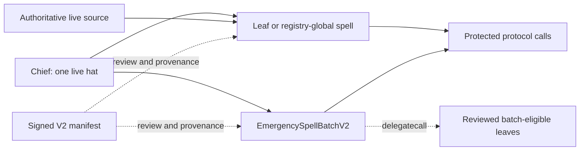

# Sky Emergency Spells

This repository contains the V2 Emergency Spell implementation for narrowly scoped actions that must remain available without waiting for the GSM delay. Emergency Spells retain the regular-spell compatibility surface used by Sky Governance tooling, but `schedule()` executes the emergency action immediately.

The architecture is based on the pinned [Emergency Spells V2 technical design](https://github.com/dewiz-xyz/team-notes/blob/7aaddd8b3cabd112c6baf14f6e975611786636a3/technical-proposals/2026/emergency-spells-v2.md).

## Architecture

V2 has three spell categories:

- **Leaf spells** protect one explicit subject, optionally with one fixed immutable action parameter. They are the durable standby artifacts and can be approved for direct use, batch use, or both.
- **Registry-global spells** act on the current contents of one authoritative live source. They are direct-use only and expose range execution for target isolation and gas management.
- **Batch spells** execute a unique list of reviewed leaves atomically through `delegatecall` in the supplied sequence. The batch is the single address elected as the Chief `hat`, so protected downstream calls still originate from the authorized address.

Fixed-list grouped spells and action-specific factories are not V2 categories. Concrete leaves and globals are deployed directly. The only reusable deployment factory is `EmergencySpellBatchFactoryV2`.



## Contracts

| Category | Contracts |
| --- | --- |
| Compatibility | `EmergencySpellV2` |
| Batch | `EmergencySpellBatchV2`, `EmergencySpellBatchFactoryV2` |
| Single-target leaves | `LineWipeSpellV2`, `ClipBreakerSpellV2`, `OsmStopSpellV2`, `DdmDisableSpellV2`, `LitePsmHaltSpellV2` |
| Standalone leaves | `SPBEAMHaltSpellV2`, `SplitterStopSpellV2`, `StUsdsRateSetterDissBudSpellV2`, `StUsdsRateSetterHaltSpellV2`, `StUsdsWipeParamSpellV2` |
| Registry globals | `GlobalLineWipeSpellV2`, `GlobalClipBreakerSpellV2`, `GlobalOsmStopSpellV2` |

The base exposes the expected spell getters and no-op regular-spell entrypoints. `done()` reports only whether the intended emergency end-state currently holds; deployment or configuration failures are surfaced by constructors, execution, tests, simulation, and operational validation rather than being reported as completed actions.

## Safety boundaries

Batch eligibility is a review property, not something the permissionless factory can establish on-chain. A batch-eligible leaf must:

- keep its execution path free of normal contract storage reads and writes;
- use constants or immutables for execution configuration;
- tolerate `address(this)` being the elected batch rather than the leaf;
- have explicit direct-use and batch-use review evidence in the V2 manifest.

The batch itself stores its reviewed leaf list and label, so it is direct-use only. It bubbles leaf revert data and rolls the complete transaction back if any leaf fails.

Batch-eligible leaves do not emit wrapper events. Canonical Mom or protocol events remain the action evidence, the batch emits `LeafExecuted(index, leaf)` after each successful delegated leaf, and the factory emits `BatchDeployed(batch, configHash)`. Registry-global spells are not batch-eligible and retain their action-specific events.

Registry-global calls are also atomic. Each action verifies its target postcondition before emitting success. If a full call fails, `emergency-spells probe-registry` simulates every singleton registry range at one pinned block and reports the failing indices and contiguous safe ranges. Operators can execute those safe ranges for partial mitigation, investigate the excluded entries, and rerun the probe against current state. Reverted calls do not produce canonical queryable events; successful range calls retain the existing action-specific success events.

No V2 constructor uses generic zero-address or bytecode-presence checks as an identity guarantee. Deployment identity is established off-chain through the signed source commit, freshly compiled creation bytecode, constructor arguments, creating transaction, receipt address, live runtime codehash, and immutable getter readbacks.

## Deployment and publication

Foundry deployment entrypoints and exact signatures are documented in [`script/README.md`](./script/README.md). Operational validation commands are documented in the [`cli/` reference](./cli/README.md):

- `emergency-spells validate-migration` reconciles every historical V1 address with its current migration status and any incident-ready V2 replacement;
- `emergency-spells validate-manifest` enforces shared spell-interface readbacks, review state, subject/parameter binding, batch dependencies, chronology, and lifecycle rules without maintaining a concrete spell allowlist;
- `emergency-spells verify-deployment` validates a direct deployment against this repository's signed `src/` checkout and live chain state;
- `emergency-spells preflight-batch` authenticates the factory and selected leaves before deployment and prints the exact configuration hash;
- `emergency-spells verify-batch` validates factory calldata and event, getters, runtime codehashes, and constructor encoding;
- `emergency-spells inspect-batch` displays a deployed batch and its leaf descriptions as an on-chain tree.
- `emergency-spells probe-registry` identifies failing registry-global entries and the ranges that can be executed atomically around them.

The CLI requires Python 3.12 or newer and uses only the Python standard library. Live-chain commands read the RPC endpoint from `ETH_RPC_URL` and invoke `cast`, `forge`, and `git` directly.

Deployment records are published under [`deployments/`](./deployments/). The manifest is an operational security boundary: an address is not ready for incident response merely because it was deployed or listed. Review status, batch eligibility, simulation attestation, canonical manifest freshness, and revocation rules are described in [`deployments/README.md`](./deployments/README.md).

The [`suggested operational runbook`](./docs/runbook.md) describes a discussion-oriented model for module handoff, ProSec deployment upkeep, incident use, and engineering enablement. It does not replace the manifest rules or establish governance authority.

## Testing

Unit and integration tests are colocated with the Solidity, deployment-script, and CLI sources they exercise. Integration test files use the `*Integration.t.sol` suffix. Local tests do not require a fork:

```sh
forge build --sizes
forge fmt --check
forge test --no-match-path '**/*Integration.t.sol'
python3 -m compileall -q cli
python3 -m unittest discover -s cli/emergency_spells -t . -v
```

Mainnet integration tests require `ETH_RPC_URL`:

```sh
forge test --match-path '**/*Integration.t.sol'
forge test --match-path 'src/clip-breaker/GlobalClipBreakerSpellV2Integration.t.sol'
```

The second command is listed explicitly because the global clip-breaker suite performs dynamic live-registry isolation and may be run separately during review.

## V1 history

V1 contracts, grouped spells, action-specific factories, tests, and scripts are not part of the active V2 tree. Historical source remains available at the signed [`v1-final`](https://github.com/sky-ecosystem/dss-emergency-spells/tree/v1-final) tag (`45651a4ecee20b80e55d941d295dbdf6fa4ea5e6`). Mainnet V1 deployment history is retained in [`deployments/1/legacy-v1.json`](./deployments/1/legacy-v1.json). Its current migration classification is tracked separately in [`deployments/1/v1-migration.json`](./deployments/1/v1-migration.json). The migration record marks all 49 historically active artifacts as waiting for a reviewed V2 replacement and all 25 historically deprecated artifacts as deprecated. The migration classification is a publication record, not proof that an address is the current Chief `hat` or ready for incident use.

No V2 audit reports are published in this repository. Production deployment requires dedicated V2 review and audit coverage.
